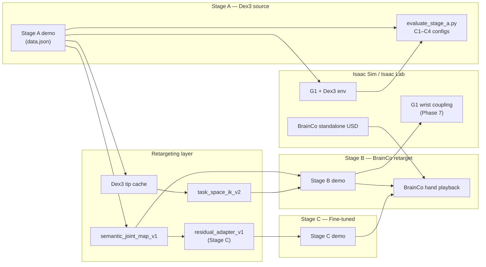

# System Architecture — Project 1

## Data flow



## Component responsibilities

| Component | Role | Frozen / trainable |
|-----------|------|-------------------|
| Source demo | Motion prior (xr_teleoperate format) | Frozen |
| Dex3 scripted policy | Stage A trajectory generator | Frozen |
| Joint-map retargeter | Dex3 7-DoF → BrainCo 6-DoF | Frozen (deterministic) |
| Task-space IK | Tip-target optimization | Frozen (deterministic) |
| Residual adapter | `q* = q_joint + f(q_joint)` | **Trainable** (Stage C) |
| BrainCo sim playback | Stage B/C validation | Eval only |

## Evaluation loop

```
configs/stage_a_eval.yaml  →  Stage A trials  →  results/stage_A/
configs/finetune.yaml      →  Stage C train   →  checkpoints/stage_C/
retarget + validate        →  Stage B demo    →  results/stage_B/
scripts/final/evaluate_final_abc.py  →  results/final/project1_abc_results.md
```

## Key paths

- Source: `checkpoints/stage_A/demos/.../data.json`
- Retarget: `checkpoints/stage_B/demos/.../data.json`
- Fine-tuned: `checkpoints/stage_C/demos/.../data.json`
- Checkpoints: `checkpoints/stage_C/residual_adapter_{right,left}.pt`
