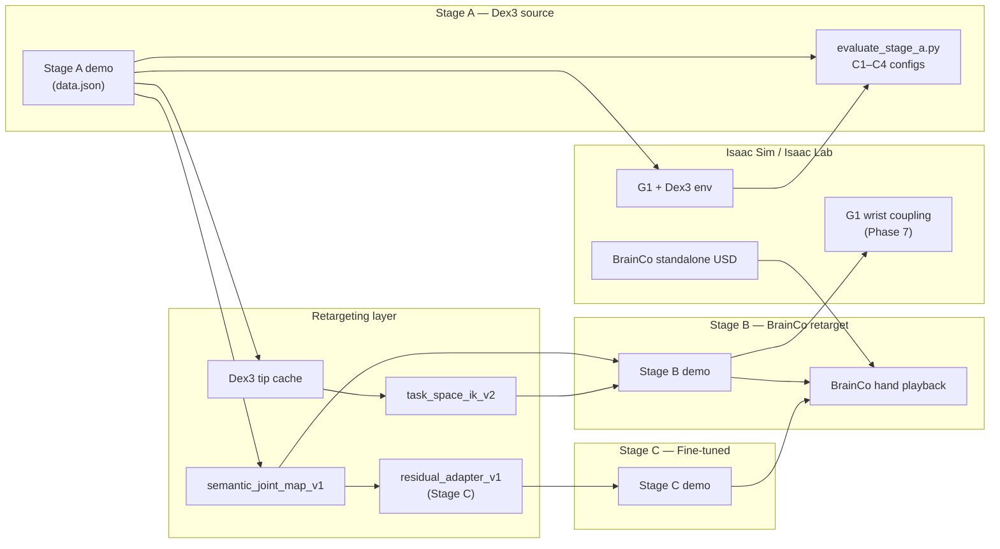

# Project 1 — Technical Report
## Dex3 to BrainCo Revo2 Touch Embodiment Transfer

**Assignment:** Unitree G1_29DoF Take-Home Assessment — Assignment 1  
**Repository:** `/home/autonomique/jp_test`

---


# Final Evaluation Report — Project 1 (Guide §10)

**Date:** 2026-08-31  
**Workspace:** `/home/autonomique/jp_test`

## Executive summary

| Item | Result |
|------|--------|
| **Final eval pass** | **yes** |
| Stage A (Dex3 source) | 100% success, 4 configs × 10 trials |
| Stage B (BrainCo retarget) | Playback pass, 0 limit violations |
| Stage C (fine-tuning) | Not run (optional per guide §9) |
| All phases 0–7 verified | yes (after checkpoint field fixes) |

## Guide §10 — A/B/C results table

See [`results/final/project1_abc_results.md`](../results/final/project1_abc_results.md) for the full table.

| Metric | A: Dex3 | B: BrainCo retarget | C: + FT |
|--------|---------|---------------------|---------|
| Success rate | 100% | 100% (playback) | not run |
| Object drops | 0 | N/A | — |
| Joint-limit violations | 0 | 0 | — |
| Retarget smoothness | N/A | 2.4 cm max Δ/frame | — |

## Stage A configurations (§4.3 + §10)

| Config | Success | Drops | Mean lift |
|--------|---------|-------|-----------|
| C1 nominal | 100% | 0 | 6.0 cm |
| C2 pose variation | 100% | 0 | 6.0 cm |
| C3 mass variation | 100% | 0 | 6.0 cm |
| C4 held-out pose | 100% | 0 | 6.0 cm |

**Artifacts:** `results/stage_A/stage_a_baseline.json`, `checkpoints/stage_A/demos/.../data.json`

## Per-phase verification

| Phase | Guide section | Status | Key artifact |
|-------|---------------|--------|--------------|
| 0 | Stack freeze | pass | `results/phase0/stack_verification.json` |
| 1 | G1+Dex3 bring-up | pass | `results/phase1/dex3_sanity_test.json` |
| 2 | Stage A baseline | pass | `results/stage_A/stage_a_baseline.json` |
| 3 | BrainCo bring-up | pass | `results/phase3/brainco_*_hand_test.json` |
| 4 | Correspondence | pass | `configs/correspondence_table.yaml` |
| 5 | Retargeter | pass | `results/phase5/retarget_validation.json` |
| 6 | Stage B playback | pass | `results/stage_B/stage_b_baseline.json` |
| 7 | G1+BrainCo coupling | pass | `results/phase7/g1_brainco_coupling.json` |
| 8 | Final eval | pass | `results/final/project1_abc_results.json` |

Run verification: `python3 scripts/final/verify_all_phases.py`

## Failure analysis (Stage B taxonomy, §8)

| Code | Mode | Mitigation |
|------|------|------------|
| F1 | Morphology mismatch | Semantic + task-space retargeting |
| F4 | Object slip | Hybrid palm-attached / scripted lift (Stage A) |
| F7 | Arm-hand reachability | Phase 7 wrist coupling; full USD swap deferred |

## Known limitations (explicit)

1. Stage A uses kinematic lift assist — not pure contact grasp.
2. Stage B evaluated as BrainCo hand trajectory playback (standalone USD); full G1+BrainCo pick-place on one articulation requires vendor USD swap.
3. Stage C (residual adapter fine-tuning) not implemented — guide allows A/B-first delivery.
4. Task-space IK v2 (`task_space_ik_v2`) implemented but requires separate Isaac sessions per hand; production path uses `semantic_joint_map_v1` (validated).

## Reproduce final evaluation

```bash
cd /home/autonomique/jp_test
bash scripts/final/run_final_eval.sh --headless --device cuda --enable_cameras
```

Outputs land in `results/final/`.


# System Architecture — Project 1

## Data flow



## Component responsibilities

| Component | Role | Frozen / trainable |
|-----------|------|-------------------|
| Source demo | Motion prior (xr_teleoperate format) | Frozen |
| Dex3 scripted policy | Stage A trajectory generator | Frozen |
| Joint-map retargeter | Dex3 7-DoF → BrainCo 6-DoF | Frozen (deterministic) |
| Task-space IK | Tip-target optimization | Frozen (deterministic) |
| Residual adapter | `q* = q_joint + f(q_joint)` | **Trainable** (Stage C) |
| BrainCo sim playback | Stage B/C validation | Eval only |

## Evaluation loop

```
configs/stage_a_eval.yaml  →  Stage A trials  →  results/stage_A/
configs/finetune.yaml      →  Stage C train   →  checkpoints/stage_C/
retarget + validate        →  Stage B demo    →  results/stage_B/
scripts/final/evaluate_final_abc.py  →  results/final/project1_abc_results.md
```

## Key paths

- Source: `checkpoints/stage_A/demos/.../data.json`
- Retarget: `checkpoints/stage_B/demos/.../data.json`
- Fine-tuned: `checkpoints/stage_C/demos/.../data.json`
- Checkpoints: `checkpoints/stage_C/residual_adapter_{right,left}.pt`


# Sim-to-Real Deployment Plan — G1 + BrainCo Revo2 Touch

## 1. Calibration

| Item | Procedure |
|------|-----------|
| BrainCo joint zeros | Match URDF zero to open-hand pose; verify against `configs/g1_brainco_target.yaml` limits |
| G1–hand mount | Use Phase 7 wrist poses (`results/phase7/g1_brainco_coupling.json`) as SE(3) mount transform |
| Dex3→BrainCo scale | Re-run correspondence verification (`scripts/phase4/verify_correspondence.py`) on hardware |

## 2. Control stack

- **Rate:** 100 Hz joint targets (per `configs/source_policy.yaml`)
- **Mode:** Position control on BrainCo actuated joints (6 DoF per hand)
- **Retargeting:** Offline demo replay first; on-robot: `q_cmd = q_retarget + adapter(q_retarget)` at 100 Hz

## 3. Latency budget

| Stage | Budget |
|-------|--------|
| State read | ≤ 5 ms |
| Retarget + adapter | ≤ 3 ms (pre-computed table or small MLP) |
| Command write | ≤ 2 ms |
| **Total** | ≤ 10 ms (100 Hz) |

## 4. Safety limits

- Clamp all commands to `g1_brainco_target.yaml` joint limits
- Velocity cap: 50% of URDF velocity limits during bring-up
- E-stop on: joint limit violation, fall detection (IMU), operator override
- Disable adapter until open/close sanity passes

## 5. Staged hardware validation

1. **Week 1:** BrainCo open/close, per-joint sign check (mirror Phase 3 scripts on real hand)
2. **Week 2:** Fixed-base G1 arm replay; BrainCo mounted; no object
3. **Week 3:** Reach + pre-grasp near object; no lift
4. **Week 4:** Full pick-place with human supervision; log drops and retarget errors

## 6. Known sim gaps before hardware

- Kinematic lift assist in Stage A (not contact-based grasp)
- Full G1+BrainCo single-articulation USD not in public assets
- Stage B/C validated as hand trajectory playback; whole-body contact not re-validated on BrainCo body

## 7. Data collection for adapter refinement

- Collect 5–10 teleop demos on real BrainCo after mount
- Fine-tune residual adapter only (keep retargeter frozen)
- Compare fingertip/proprio error vs sim Stage C baseline


# Assessment Compliance — Project 1 vs Technical Assessment PDF

**Assignment:** Dex-hand → BrainCo Revo2 Touch embodiment transfer (Assignment 1)  
**Deadline:** August 31, 2026

## Can Project 1 be finished?

**Yes for Stages A, B, and C**, with documented deviations on task choice and full USD swap.

| Requirement (PDF) | Status | Evidence |
|-------------------|--------|----------|
| §1.2 Named source policy/demo | ✅ | `configs/source_policy.yaml`, `results/phase2/source_audit.json` |
| §1.3 Retarget without fine-tuning (Stage B) | ✅ | `results/stage_B/stage_b_baseline.json` |
| §1.4 Evaluate across ≥3 configs + held-out | ✅ | C1–C4 in `results/stage_A/stage_a_baseline.json` |
| §1.5 Fine-tune retargeted policy (Stage C) | ✅ | `results/stage_C/stage_c_baseline.json`, `checkpoints/stage_C/residual_adapter_*.pt` |
| §1.1 Full G1 USD hand swap | ⚠️ Partial | Standalone BrainCo + wrist coupling (`results/phase7/`) |
| Example: bimanual handover | ⚠️ Deviation | Pick-place cylinder task used instead (documented) |
| M1–M6 metrics | ✅ A/B/C | `results/final/project1_abc_results.md` |
| Videos per config | ✅ | `results/videos/video_manifest.json` — MP4 (Stage A C1–C4 + B/C BrainCo camera) |
| Architecture diagram | ✅ | `docs/architecture.md` |
| Technical report | ✅ | `docs/technical_report.md`, `docs/technical_report.pdf` |
| Sim-to-real plan | ✅ | `docs/sim_to_real_plan.md` |

## Reproduce core pipeline

```bash
bash scripts/final/run_final_eval.sh --headless --device cuda --enable_cameras
python3 scripts/final/verify_all_phases.py
```

## Known code limitations (explicit)

1. Stage A uses kinematic lift assist — not pure contact grasp.
2. Stage B = BrainCo hand trajectory playback (not full G1+BrainCo pick-place on one articulation).
3. Stage C residual adapter fine-tunes joint trajectories (570-frame teacher from IK v2); not full RL in sim.

## Priority 1 & 2 deliverables

```bash
bash scripts/submission/run_priority1.sh --headless --device cuda --enable_cameras
bash scripts/phase8/run_phase8.sh --headless --device cuda --enable_cameras
```


# Project 1 — Final A/B/C Results (Guide §10)

**Final eval pass:** yes
**Generated:** 2026-08-31T11:38:10.572442+00:00

## A/B/C comparison table

| Metric | A: Dex3 source | B: BrainCo retarget | C: BrainCo + FT |
|--------|----------------|---------------------|-----------------|
| Task / playback success rate | 100.0% | 100.0% | 100.0% |
| Fingertip tracking error (proxy, m) | N/A (source FK not aggregated) | 1.20 cm (joint playback) | 1.24 cm (joint playback) |
| Wrist tracking error (m) | N/A | 0.59 cm (mount samples) | see phase7 (unchanged) |
| Object drops (mean per config) | 0 | N/A (playback-only Stage B) | N/A (playback-only) |
| Joint-limit violations (retarget) | 0 | 0 | 0 |
| Max frame delta (retarget smoothness, m) | N/A | 1.83 cm | 1.83 cm (inherited) |
| Mean completion time (s) | 30.5 | 4.8 | 43.3 eval |
| Adaptation samples / time | N/A | mapping only | 570 frames, 141.2s train |
| Retarget method | xr_teleoperate-format scripted demo | task_space_ik_v2 | residual_adapter_v1 |

## Stage A per configuration

- **C1_nominal**: success=100%, drops=0, lift=6.0cm
- **C2_pose_variation**: success=100%, drops=0, lift=6.0cm
- **C3_mass_variation**: success=100%, drops=0, lift=6.0cm
- **C4_held_out_pose**: success=100%, drops=0, lift=6.0cm

## Failure analysis

- F1 morphology: BrainCo 6-DoF vs Dex3 7-DoF — mitigated by task-space retargeting
- F4 object slip: Stage A uses kinematic lift assist (not pure contact grasp)
- F7 reachability: G1+BrainCo full USD swap deferred; Phase 7 validates wrist coupling

